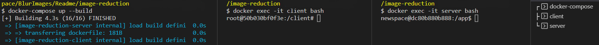
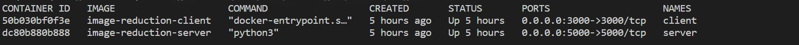
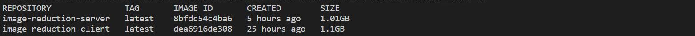
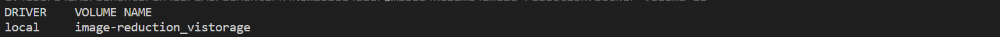

# Image Reduction

This project is a full-stack application designed to blacking pixels in an image based on a pixel matrix, without losing the image metadata.

## Table of Contents

- [Project Overview](#project-overview)
- [System requirements](#system-requirements)
- [Technologies](#technologies)
- [Server-Side Dependencies](#server-side-dependencies)
- [Client-Side Dependencies](#client-side-dependencies)
- [Installation](#installation)
- [Usage](#usage)
- [API Documentation](#api-documentation)

## Project Overview

The purpose of this project is to allow users to blacking specific pixels in an image based on a polygon frame selected by the user.  
The application consists of a server-side written in Python and a client-side written in React.

## System requirements

1. Visual Studio Code work environment.
2. docker desktop.
3. Container volume with 8 cores and 4 GB of RAM.
​

## Technologies

- Server-Side: Python
- Client-Side: React

## Server-Side Dependencies

The following dependencies are required to run the server-side of this project:

- rasterio
- numpy
- pytest
- pytest_mock
- flask
- flask-cors
- waitress
- shapely

These dependencies exist in my 'install_requires' list in the 'setup.py' file.

## Client-Side Dependencies

The following dependencies are required to run the client-side of this project:

- @testing-library/jest-dom (version ^5.17.0)
- @testing-library/react (version ^13.4.0)
- @testing-library/user-event (version ^13.5.0)
- axios (version ^1.6.4)
- bootstrap (version ^5.3.2)
- devextreme (version 23.2.3)
- devextreme-react (version 23.2.3)
- react (version ^18.2.0)
- react-bootstrap (version ^2.9.2)
- react-dom (version ^18.2.0)
- react-jss (version ^10.10.0)
- react-scripts (version 5.0.1)
- web-vitals (version ^2.1.4)

These dependencies can be installed by running `npm install` in the client-side project directory.
  
## Installation

Please follow these steps to install and configure the project on your local machine:

1. Open Visual Studio Code.
2. Clone the repository.
3. After cloning the project, navigate to the project directory.
4. Create a new file in the project directory and name it `.env`.
5. Open the `.env` file in a text editor.
6. Add the following two variables to the `.env` file:

   ```text
   DEVICE=relative_position_of_image_folder
   REACT_APP_SERVER_PATH=routing_address_to_server
   ```

   Replace `relative_position_of_image_folder` with the relative position of the image folder to the project.  
   For example, if the image folder is in the same directory as the project, you can set it as `./images`.

   Replace `routing_address_to_server` with the routing address that the client addresses to the server.  
   For example, if the server is hosted locally and the endpoint is `/api`, you can set it as `http://localhost:5000/api`.

7. Make sure Docker is running on your computer.
8. Start a bash terminal and navigate to the base directory of the project the "images-reduction" folder like this:
       ```
    cd images-reduction
       ```
9. Run the following command to start building the containers:

      ```bash
       docker-compose up --build
      ```

      Wait for the construction of the containers to finish.

10. Open a new bash terminal and run the following command to access the client container:

       ```bash
       docker exec -it client bash
       ```

      This will open a bash terminal inside the client container.

11. Open a new bash terminal and run the following command to access the server container:

       ```bash
       docker exec -it server bash
       ```

      This will open a bash terminal inside the server container.  

    This is what it should look like in the terminal:
    

    This is what it should look like when you run the following commands:

       ```bash
       docker container ls
       ```

    

    ```bash
       docker image ls
       ```

    

    ```bash
       docker volume ls
       ```

    

12. Inside the terminal of the client container, run the following command to install the required dependencies:

       ```bash
       npm install
       ```

13. Build the client by running the following command:

       ```bash
       npm run build
       ```

14. Start the client by running the following command:

       ```bash
       npm run start
       ```

15. To install the required dependencies, execute the following command in your terminal:

       ```bash
       pip install .
       ```

16. Start the server by running the following command:

       ```bash
       python src/app.py
       ```

## Usage

To use the application, follow the steps below:

1. Ensure that the client and server are running as described in the installation instructions.
2. Open a web browser and navigate to `http://localhost:3000` to access the client-side of the application.
3. Click the "Select" button to search for an image.
4. The application sends a GET request to the `/api/get_images_names` endpoint to retrieve the names of images and folders in the specified directory.
5. Select an image from the tree view component.
6. Draw the desired frame on the selected image using the mouse.
7. Confirm the selected frame and click the "Submit" button.
8. The application sends a POST request to the `/api/blackening_pixels` endpoint to modify the selected image by darkening the specified pixels within the polygon frame.
9. After the blackout process is complete, the user is presented with a message indicating the successful blackout.
10. You can choose to display the blacked-out image by clicking on the relevant option provided.

## API Documentation

### Get Images Names

- Endpoint: `/api/get_images_names`
- Method: GET
- Purpose: Retrieve the names of images and folders in the specified directory path.

#### Request(1)

- Query Parameters:
  - `directory_path`: The directory path from which you want to obtain the images and folder names.

#### Response(1)

- Status Code: 200 (OK)
- Response Body Format: JSON array

#### Example Request(1)

```text
GET /api/get_images_names?directory_path=/images
```

#### Example Response(1)

```json
[
    "/images/cake.jpg",
    "/images/gal.jpg",
    "/images/hello/cakes.jpg",
    "/images/hello/world/galss.jpg"
]
```

#### Error Handling(1)

- If the specified directory path does not exist or is invalid:
  - Status Code: 404 (Not Found)
  - Error Message: "The path {file_path} was not found"

- If any other exception occurs during execution:
  - Status Code: 400 (Bad Request)
  - Error Message: An error message is tailored to the error

### Blackening Pixels

- Endpoint: `/api/blackening_pixels`
- Method: POST
- Purpose: Modify the provided image by blackening certain pixels within a specified polygon frame.

#### Request(2)

- Body Format: JSON
- Properties:
  - `imagePath`: Path to the image file.
  - `polygonFrame`: Pixel matrix of the polygon frame.

#### Response(2)

- Status Code: 200 (OK)
- Response Body Format: Plain text

#### Example Request(2)

POST /api/blackening_pixels

```json
{
    "imagePath":"/images/b.jp2",
    "polygonFrame":"[[1,3], [2,3], [3,3], [4,3], [4,4], [4,5], [4,6], [3,7], [2,7], [1,6], [1,5], [1,4] ]"
}
```

#### Example Response(2)

```text
The image has been blackened successfully
```

#### Error Handling(2)

- If the specified image file does not exist:
  - Status Code: 404 (Not Found)
  - Error Message: "The path {file_path} was not found"

- If any other exception occurs during execution:
  - Status Code: 400 (Bad Request)
  - Error Message: An error message is tailored to the error
